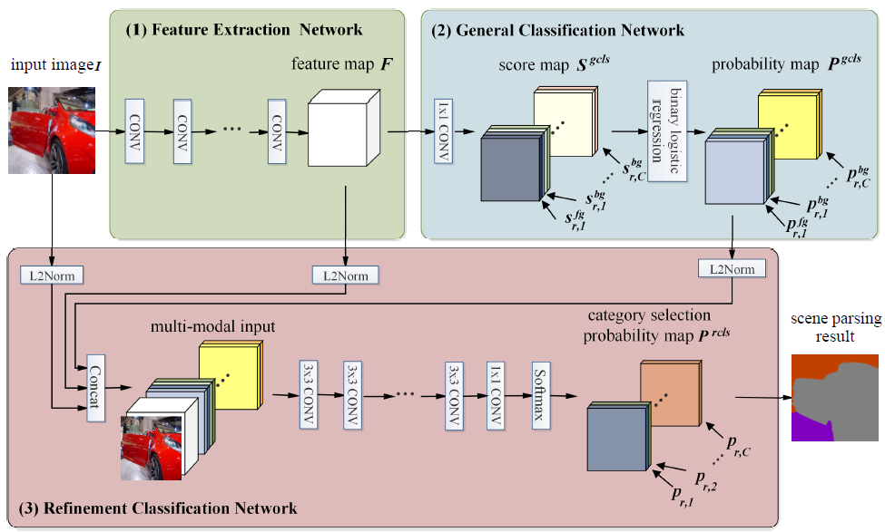
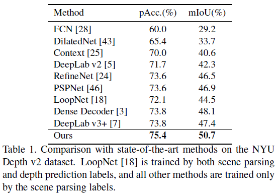

# Scene Parsing via Integrated Classification Model and Variance-Based Regularization

The code for the following paper:
* Hengcan Shi, Hongliang Li, Qingbo Wu, Zichen Song, “Scene Parsing via Integrated Classification Model and Variance-Based Regularization”, IEEE Conference on Computer Vision and Pattern Recognition (**CVPR**). Long Beach, the U.S. June 16-20, 2019. [PDF](http://openaccess.thecvf.com/content_CVPR_2019/papers/Shi_Scene_Parsing_via_Integrated_Classification_Model_and_Variance-Based_Regularization_CVPR_2019_paper.pdf)

## Citation
```
@InProceedings{Shi_2019_CVPR,
author = {Shi, Hengcan and Li, Hongliang and Wu, Qingbo and Song, Zichen},
title = {Scene Parsing via Integrated Classification Model and Variance-Based Regularization},
booktitle = {The IEEE Conference on Computer Vision and Pattern Recognition (CVPR)},
month = {June},
year = {2019}
}
```

## 1. Introduction
Existing deep-learning-based methods usually use one general classifier to recognize all object categories. However, the general classifier easily makes some mistakes in dealing with some confusing categories that share similar appearances or semantics. In this paper, we propose an integrated classification model and a variance-based regularization to achieve more accurate classifications. On
the one hand, the integrated classification model contains multiple classifiers, not only the general classifier but also a refinement classifier to distinguish the confusing categories. On the other hand, the variance-based regularization differentiates the scores of all categories as large as possible to reduce misclassifications. Specifically, the integrated classification model includes three steps. The
first is to extract the features of each pixel. Based on the features, the second step is to classify each pixel across all categories to generate a preliminary classification result. In the third step, we leverage a refinement classifier to refine the classification result, focusing on differentiating the high-preliminary-score categories. An integrated loss with the variance-based regularization is used to train the model.



## 2. Results



## 3. Usage
### 3.1. Installation
1. Install **Matlab** (The version lower than 2014b is highly recommended. Higher versions may be incompatible with Caffe.)
2. Install my modified **Caffe** and **matcaffe** ([Download](https://github.com/shihengcan/caffe-2017))

### 3.2. Data preparation
1. Download the datasets ([NYU_Depth_v2](https://1drv.ms/u/s!AvfIPDGY8WV2imwRXhggFQpudWqQ?e=ztcgPu))
2. Please uncompress the datasets and put them in folder `./data`
3. Download models ([initialization_model](https://1drv.ms/u/s!AvfIPDGY8WV2im1Y2Jpl4c6k9sdl?e=npgoFE)，[trained_on_NYU_Depth_v2](https://1drv.ms/u/s!AvfIPDGY8WV2im67cRYdJdDkqUC1?e=4jcxQi))
4. Please put models in folder `./models`

### 3.3. Training
1. Open the file `./net_train.m`
2. Modify the config, including the caffe path, opts.dataset, opts.useGpus and others.
3. Run the file `./net_train.m`
4. If you want to train on your own datasets, please modify files to fit your dataset and run the file `./generate_bicls_label.m` to generate labels for the binary classification.

### 3.4. Evaluation
1. Open the file `./net_test.m`
2. Modify the config, including the caffe path, opts.dataset, opts.useGpus and others.
3. Run the file `./net_test.m`

## Acknowledgement
Thanks the evaluation code from [sceneparsing](https://github.com/CSAILVision/sceneparsing)!

## Contact
shihengcan AT gmail DOT com

